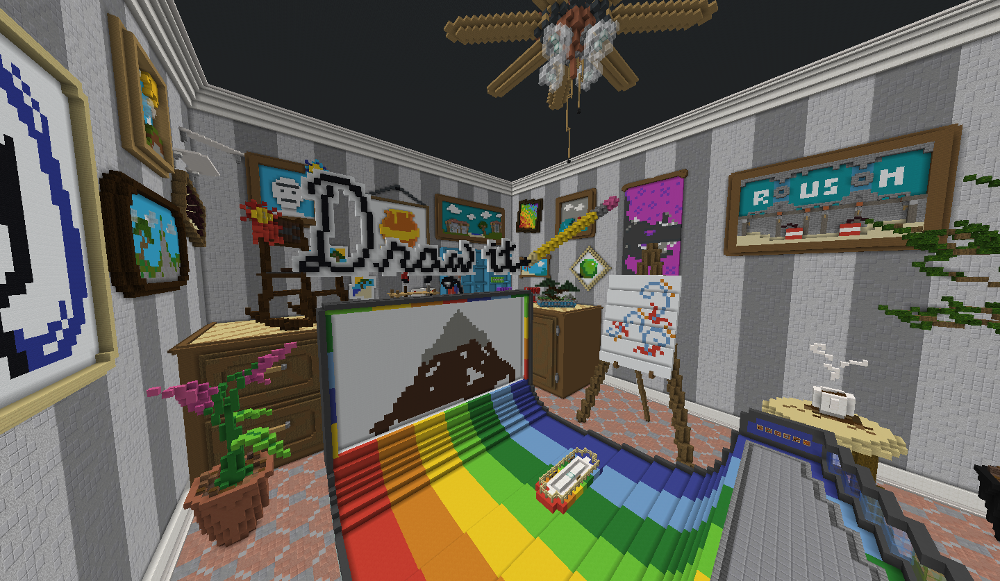

# HiveMC Archive

An archive of various HiveMC world save files from April 2021, shortly before the server shuts down.

See the [releases tab](https://github.com/Nixinova/HiveMC/tags) for a list of all save file downloads.

----

## Hub
[Download](https://github.com/Nixinova/HiveMC/releases/tag/hub)

The HiveMC main hub. Contains a central area connected to the various rooms corresponding to each game on the server.

<table><tr><td>

</td><td>

</td></tr></table>

----

## Arcade Shuffle
**[Browse](arcade-shuffle)**

----

## BedWars
**[Browse](bedwars)**

----

## Block Party
[Download](https://github.com/Nixinova/HiveMC/releases/tag/block-party)

----

## Draw It
[Download](https://github.com/Nixinova/HiveMC/releases/tag/draw-it)

----

## Hide and Seek
**[Browse](hide-and-seek)**

----

## Splegg
**[Browse](splegg)**

----

## Survival Games
**[Browse](survival-games)**

----

## Trouble in Mineville
**[Browse](timv)**

